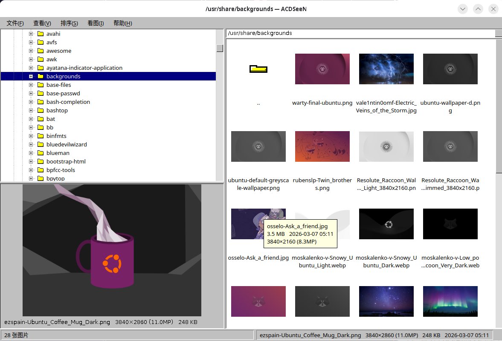

# ACDSeeN

*[简体中文](README.zh-CN.md)*

A remake of ACDSee 1.2x (1996) — one browser, one viewer.

No database, no editor, no cloud. Just open fast, page without stutter, and keep
your hands on the keyboard.



> The interface looks like that **on purpose**. Grey background, chiseled 3D
> borders, navy selection bar, aliased bitmap font — this is not unfinished work,
> and not a theme I couldn't be bothered to configure. It was matched against the
> 1996 original one detail at a time. If it grates, turn it off under
> **View → Windows 95 look** and get your native system style back.

## Why this exists

I have never been able to find an image viewer as good as SEA or the old ACDSee:
simple, pure, fast.

Thirty years on, the best image viewer I have ever used is still that ACDSee —
including, and especially, compared to the bloated thing it became. More features
piled on, slower to open, when all I ever wanted was to **look at pictures**.

So I built one. Consider it a tribute.

## Which version this remakes

ACDSee first shipped in 1994 as a 16-bit program for Windows 3.x. This project
remakes **1.2x (1996)**. That version knew exactly what it was:
**not an image manager, and not an editor** — just a Browser and a Viewer.

| What the original 1.2x had | Here |
|---|---|
| Image Browser: folder tree + color thumbnails + preview pane | ✅ |
| Built-in delete / rename / copy / move | ✅ |
| Image Viewer: full screen, zoom, fast scrolling | ✅ |
| Scroll and zoom while the image is still decoding | ✅ two-stage decode |
| Slideshow, automatic or manual, next image pre-read | ✅ |
| BMP GIF JPG PNG PCX TGA TIFF Photo-CD | ✅ plus WebP / PSD / AVIF |

Anything the original did **not** have stays out: no tagging, no EXIF panel, no
editing, no batch processing, no plugins. That is all 3.0-and-later accretion —
and the reason a "simple image viewer" is so hard to find today.

## Features

- **Browser**: folder tree on the left with a preview pane below it (select an
  image, see it large), thumbnails or a detail list on the right. One directory
  at a time — no recursion, no catalog, no scanning your whole drive
- **Windows 95 look**: `#C0C0C0` grey, 2px chiseled borders, `#000080` navy
  selection bar, `+/-` box tree, yellow folder icons, non-antialiased bitmap
  font, square-arrow scrollbars. On by default, switchable under View
- **Path bar + `..` row**: type a path in the top right to jump straight there;
  the first row of the list is the parent directory
- **Sorting**: name / file size / type / date modified / total pixels / width /
  height / random, each reversible; in list mode, click a column header to sort
- **Viewer**: full screen, nothing on screen but the image, with all information
  moved into a toggleable OSD overlay
- **Never says "Loading"**: two-stage decode plus pre-read, so paging is
  instantaneous (see [How it works](#how-it-works))
- **Fully keyboard-reachable**: rename / delete / copy / move are built in — no
  switching back to a file manager
- **Slideshow**: any interval in seconds (including 0 = advance as soon as the
  decode finishes), optional shuffle, with arrow keys, zoom and click-to-advance
  all still live

## Installing

Requirements:

- Python 3.10+
- [PySide6](https://pypi.org/project/PySide6/) (required)
- [Pillow](https://pypi.org/project/Pillow/) (optional — only as a fallback for
  PCX/PCD/PSD and other old formats Qt doesn't know)

```bash
git clone https://github.com/baojie/acdseen.git
cd acdseen
./setup.sh        # creates a virtualenv and installs dependencies
```

Or by hand:

```bash
python3 -m venv .venv
.venv/bin/pip install -r requirements.txt
```

You can also install it as a command (then just type `acdseen`):

```bash
pip install .            # with the old-format fallback: pip install '.[legacy]'
```

Platform: developed and used daily on Linux. Exactly one code path — "open in
file manager" — uses `xdg-open`; everything else goes through Qt, so Windows and
macOS should work, but neither has been tested.

## Using it

```bash
./run.sh                       # opens the last directory (or the current one)
./run.sh ~/Pictures            # opens the browser on that directory
./run.sh photo.jpg             # goes straight to full screen, with the rest of
                               # the directory queued up behind it
```

Equivalent to `python -m acdseen [args]`.

## Supported formats

| Source | Formats |
|--------|---------|
| Qt built-in | BMP, GIF, JPEG/JPG, PNG, TGA, TIFF, WebP, PBM/PGM/PPM, XBM, XPM, ICO, SVG |
| Pillow fallback | PCX, Photo-CD (PCD), PSD, JP2, AVIF, HEIC |

The thumbnail disk cache lives in `~/.cache/acdseen/thumbs` (XDG-compliant) and
can be cleared any time from **View → Clear thumbnail cache**.

## Keyboard shortcuts

### Browser

| Key | Action |
|------|------|
| `Enter` / double-click | View image |
| `Backspace` | Go to parent directory |
| `F2` | Rename |
| `Del` | Delete |
| `Ctrl+C` / `Ctrl+X` / `Ctrl+V` | Copy / cut / paste into current directory |
| `Ctrl+Shift+C` / `Ctrl+Shift+M` | Copy to… / Move to… |
| `Ctrl++` / `Ctrl+-` | Larger / smaller thumbnails |
| `F5` | Refresh |
| `F8` | Toggle thumbnails / list |
| `Ctrl+1` / `Ctrl+2` | Thumbnail mode / list mode |
| `F9` | Show / hide the folder tree |
| View → Preview pane | Show / hide the preview of the selected image |
| `Ctrl+S` | Full-screen slideshow from the first image |
| Right-click → Slideshow | Full-screen slideshow from the image you clicked |

### Viewer

| Key | Action |
|------|------|
| `Space` / `PgDn` / `→` | Next image |
| `Backspace` / `PgUp` / `←` | Previous image |
| `Home` / `End` | First / last image |
| `+` / `-` | Zoom in / out |
| `Z` | Scale to display box (**default**: small images are enlarged to fill) |
| `*` | Fit to window (small images not enlarged — original ACDSee behavior) |
| `/` | Actual size, 1:1 |
| `W` | Fit to width |
| `F` / `Enter` / `F11` | Toggle full screen |
| `S` | Slideshow on/off |
| `R` | Shuffle on/off |
| `D` | Set the slideshow interval (any number of seconds, `0` = as fast as possible) |
| `[` / `]` | Interval down / up (steps: 0 / 0.5 / 1 / 2 / 3 / 5 / 10 / 15 / 30 / 60 s) |
| `I` | Show / hide the info bar |
| `Del` | Delete the current image |
| `Esc` | Leave full screen / back to the browser |

**Mouse**: click to advance, drag to pan, wheel to page, `Ctrl+wheel` to zoom,
middle-click to toggle fit/1:1, double-click for full screen.

## How it works

Measured (4000×3000 JPEG, cold cache, Python 3.14 + PySide6):

```
Python import + QApplication : 199 ms
first frame on screen        : 255 ms      <- the "it opened" moment
full resolution ready        : 331 ms
```

Never showing a "Loading" state comes from three channels running in parallel:

1. **Two-stage decode.** First a 1024px-edge preview via
   `QImageReader.setScaledSize()` — JPEG takes the DCT-scaling path, 4–8× faster
   than a full decode — and it goes on screen immediately. The full-resolution
   decode of the same image continues on a background thread and swaps in
   seamlessly, with zoom and pan parameters preserved.
2. **Pre-read.** While you sit on image *i*, the background fully decodes
   `i±2` into an LRU cache, so paging is a cache hit and the very first frame is
   already full resolution.
3. **A separate thumbnail channel.** Thumbnails get their own thread pool and
   disk cache (the key includes path + mtime + size, so an edited file
   invalidates itself) and never contend with the viewer's decode threads.
   Changing directory bumps a generation counter that voids every in-flight task.

The **preview pane** at the bottom left works the same way: single-threaded
decode, generation-based invalidation, target size tracking the pane (the
original reloaded whenever the preview area was resized; here a single-shot
QTimer debounces it). It pauses while you're viewing so it never competes with
the viewer for CPU.

## Project layout

```
acdseen/
├── __main__.py    entry point
├── main.py        startup logic (directory / single image / last directory)
│
├── browser.py     browser window skeleton: tree, splitters, directory changes, status bar, settings
├── thumbmodel.py  ├─ multi-column model (shared by both views) + thumbnail cell painting
├── viewpanes.py   ├─ the thumbnail grid and detail list views, switching, header sorting
├── menus.py       ├─ menu bar, context menu, help and about
├── fileops.py     ├─ file operations: rename / delete / copy / cut / paste / copy to / move to
├── viewhost.py    ├─ page switching between browsing and viewing
├── helptext.py    └─ the F1 shortcut table
├── theme.py       Windows 95 look: palette + stylesheet + hand-drawn tree branches and arrows
├── preview.py     preview pane: large preview of the selection, single-thread decode, debounced reload
│
├── viewer.py      full-screen viewer: navigation, load callbacks, zoom, key and mouse events
├── slideshow.py   ├─ slideshow interval and shuffle
├── render.py      └─ paintEvent and the OSD overlay
│
├── loader.py      decode layer: thumbnail thread pool, two-stage load, pre-read, LRU
├── config.py      the "feel" parameters, all in one place (zoom steps, cache sizes, pre-read count…)
└── util.py        formatting, natural sort, and other small helpers
```

`viewpanes` / `menus` / `fileops` / `viewhost` / `slideshow` / `render` are
mixins, not standalone classes. They read the current selection, refresh the
list, and write to the status bar — the coupling to the host is real, and
forcing it apart into "pass in a pile of callbacks" would only obscure it. Each
file's docstring states exactly which host attributes and methods it relies on.

## Development

```bash
./setup.sh && ./run.sh        # set up and run
```

Design trade-offs are documented in each module's docstring; the "feel"
parameters live in `config.py`.

What the Windows 95 look is still missing, and what is deliberately left out, is
in [`ref/win95-gaps.md`](ref/win95-gaps.md), with the reference screenshot in the
same directory.

### Tests

```bash
.venv/bin/pip install -r requirements-dev.txt
.venv/bin/python -m pytest
```

Everything runs under `QT_QPA_PLATFORM=offscreen`, so no real display is needed;
the thumbnail cache and QSettings are redirected to temporary directories and
will not touch your `~/.cache` or your real configuration.

Fixtures generate test images according to what the environment can actually
write: Qt cannot write GIF at all, TIFF depends on whether the `qtimageformats`
plugin is present, and PCX only works via Pillow. Formats that can't be written
aren't generated, and the corresponding tests skip themselves.

Three tests in `tests/test_loader.py` map directly to real bugs fixed during
development. Deleting them re-digs the holes:

| Test | The hole it covers |
|---|---|
| `test_多线程并发解码pcx不崩溃` (concurrent PCX decode doesn't crash) | Pillow's lazy plugin import crashed shiboken under multiple worker threads (process-level fatal error) |
| `test_缩略图确实生成且尺寸正确` (thumbnails are generated at the right size) | `QImage.scaled()` was passed an int instead of a Qt enum; the task threw silently and every thumbnail came back empty |
| `test_pil兜底不经过ImageQt` (the PIL fallback avoids ImageQt) | `PIL.ImageQt` blows up when it touches the Qt bindings from a worker thread; the `QImage` has to be built from raw bytes instead |

Release notes are in [`CHANGELOG.md`](CHANGELOG.md).

## Notes

This is an independent implementation, written from memory and screenshots. It
contains no original code or assets and has no connection to ACD Systems or its
ACDSee trademark. The "N" stands for New — and for "this is not that ACDSee".

Licensed [MIT](LICENSE).
