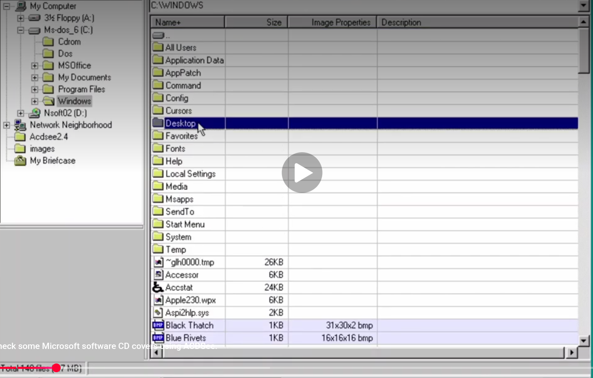

# Windows 95 外观：尚未实现的部分

对照参考截图（ACDSee 2.4 跑在 Windows 95 上，见 `acdsee-2.4-win95.png`）
逐项比对当前实现，记录还差什么。**这是待办清单，不是缺陷列表** —— 其中有几条是
刻意不做的，理由一并写在下面。

已经实现的部分见 `../acdseen/theme.py`：`#C0C0C0` 灰底、2px 立体边框、`#000080`
整行深蓝选中、凸起表头按钮、`+/-` 方框与虚线目录树、方块箭头滚动条、凹陷分格
状态栏、列分隔线、淡黄 tooltip、黄文件夹图标。

---

## ✅ 优先级 A —— 已完成

> 2026-08-03 全部实现。下面保留当初的分析和实现要点，方便回看为什么这么做。

### A1. 字体没关抗锯齿 ✅

Win95 用 MS Sans Serif，**位图字体，无抗锯齿**。现代 Linux 上没有这个字体，
`theme.ui_font()` 实测退到了 `DejaVu Sans`，而且**抗锯齿是开着的**，字一发虚，
整个界面立刻"现代"了 —— 这是最容易被忽略、但最影响年代感的一条。

改 `QFont.StyleStrategy.NoAntialias` 基本是一行的事。再进一步可以内嵌一份
自由授权的 Win95 风格位图字体。

**代价**：极低。**收益**：高。

**已实现**：`theme.ui_font()` 设 `QFont.NoAntialias` + `PreferFullHinting`。
内嵌自由授权位图字体这一步没做 —— 现在退到 DejaVu Sans，关掉抗锯齿后观感已经够。

### A2. 没有路径栏 ✅

参考截图右上角那个显示 `C:\WINDOWS` 的凹陷框，右端带 ▼ 下拉箭头。这是整张图
里最抢眼的控件之一，我们一点都没有 —— 当前目录只出现在窗口标题里。

**已实现**：`viewpanes.py` 里一个可编辑 `QComboBox`，下拉列出各级祖先，回车切目录。

有个坑：往 `QComboBox` 里塞条目会触发 `activated` 信号，不挡就会从
`set_directory` 递归回 `set_directory`。`_sync_path_bar` 里 `blockSignals` 挡掉了，
有回归测试盯着。

### A3. 列表缺 `..` 上级目录行 ✅

参考截图的文件列表第一行就是 `..`，带一个向上的文件夹图标，可以直接点。
我们只能按 Backspace，没有可点的目标。

**已实现**，并且确实按"显式区分"来做的：

- `_paths` 只装图片，导航行由 `_parent_dir` 单独表示，`_offset()` 换算两套编号
- 对外一律用**视图行号**（`index_of` / `first_image_row`），
  内部用**图片下标**（`image_index` / `image_count`）
- `path_at()` 对导航行返回 `None` —— 选择集、预览、文件操作全靠这一条挡住
- `_start_slideshow(start)` 的参数是**图片下标**不是视图行号，用错会每次从第二张开始

踩到的：`_on_thumb` 里 `index_of` 已经返回视图行号，再加一次偏移就发出了越界的
`dataChanged`（Qt 会打印 `QModelIndex(-1,-1)` 警告）。

### A4. 驱动器图标没分类型 ✅

参考截图里软驱（3½ Floppy A:）、硬盘（Ms-dos_6 C:）、光驱、网络邻居、公文包
各有各的图标，我们只有一个通用的灰盒子。

**已实现**：新增 `FLOPPY` / `CDROM` / `NETWORK` / `PARENT` 四组 16×16 网格，
`Win95IconProvider` 按 `QFileIconProvider.IconType` 分发。

**注意收益有限**：Linux 上没有盘符，目录树里几乎全是普通文件夹，只能按挂载点
名字（`cdrom` / `fd0` 之类）猜一猜。真正用上的是 `PARENT` —— 列表第一行那个
"上级目录"图标。

---

## 优先级 B —— 值得做，但要先想清楚（未做）

### B1. 工具栏

菜单栏下面那排 3D 立体按钮。参考截图裁掉了这部分，但 ACDSee 2.x 是有的。

做之前得先决定放什么 —— 本项目的功能面比原版窄，硬凑一排按钮不如不做。

### B2. 排序指示用列名后缀而不是箭头

原版是 `Name+` / `Name-` 这样在列名后面缀符号，我们用的是 Qt 原生三角箭头。

改法：`ThumbModel.headerData()` 里按当前排序拼后缀，同时关掉 `setSortIndicatorShown`。
注意别和菜单「排序」的状态同步逻辑打架（见 `viewpanes.py::_sync_sort_indicator`）。

### B3. 树根不是「我的电脑」

参考截图的目录树从 My Computer 这个虚拟节点长出来，下面才挂各个盘符和桌面项。
我们直接从文件系统 `/` 开始。

Linux 上没有盘符，硬套会很别扭。可以考虑做一个虚拟根，挂上 `~`、`/`、
以及 `/media` 下的挂载点。

### B4. 行高偏松

参考截图每行约 15px，我们要宽一些。跟 A1 的字体一起调更合适。

### B5. 选中条不是通栏到底

参考截图里 Desktop 那一行的深蓝一路铺到窗口最右边，**越过了最后一列的边界**。
我们的选中高亮只铺到内容区宽度。视觉上原版更"实"。

### B6. 图片文件的行有淡紫底色

参考截图最下面 Black Thatch / Blue Rivets 两行是淡紫（约 `#e8e8f8`），而上面
的文件夹和普通文件是白底 —— 原版用背景色区分"这是 ACDSee 认得的图片"。

这和我刚关掉的 `setAlternatingRowColors` 不是一回事：它不是隔行交替，而是按
**文件类型**上色。我们的列表里全是图片，照搬会变成一片紫，得先有 B2/C2
（列表里混排非图片文件）才有意义。

### B7. 树里选中项只高亮文字

参考截图左边 Windows 那一项，灰色高亮**只框住文字**，没有铺满整行；而右边
文件列表是整行通栏。两个控件的选中样式在原版里是不同的，我们两边都是整行。

---

## 优先级 C —— 有意不做（不打算做）

### C1. 自绘标题栏与窗口边框

参考截图顶部那条渐变蓝标题栏加三个方块按钮。我们用的是系统窗口装饰，在 Linux
上永远不会长成那样。

要做只能改成无边框窗口自己画。**代价是失去窗口管理器的原生行为** —— 贴边分屏、
`Super` 系快捷键、多显示器处理、各桌面环境的窗口规则全要自己重做，而且很难做对。
除非明确要"整窗复刻"，否则不建议。

### C2. 文件列表里混排子文件夹

参考截图里 All Users / AppData / Command… 全是文件夹，和文件排在一起。
我们的列表**只放图片**。

这不是换皮的问题，是改产品定义 —— "只看一个目录里的图片，不递归、不建库"是这个
项目的核心取舍（见 README）。真要做，`..` 行（A3）才是更小的那一步。

### C3. 文件类型小图标

参考截图里 BMP / SYS / EXE 各有各的图标。我们显示的是缩略图。

**缩略图正是 ACDSee 的卖点**，用类型图标换掉它是倒退。列表模式下那个 40px 的
小缩略图已经承担了同样的辨识功能。

---

## 参考图

`acdsee-2.4-win95.png`（1430×911）—— ACDSee 2.4 的文件浏览器窗口。
截自一段视频，所以中间有个播放按钮浮层，底部压着一行字幕，这两处不是界面的一部分。

图里值得反复对照的地方：

- 左：目录树从 `My Computer` 虚拟根长出，下面是 `3½ Floppy (A:)`、`Ms-dos_6 (C:)`、
  `Nsoft02 (D:)`、`Network Neighborhood`、`My Briefcase` —— 每类一个专属图标。
  展开的 `Windows` 项高亮**只包住文字**。
- 右上：`C:\WINDOWS` 路径栏，右端一个 ▼ 下拉箭头。
- 表头：`Name+` / `Size` / `Image Properties` / `Description`，
  排序方向是**列名后缀 `+`**，不是箭头。
- 第一行是 `..`，带一个横条状的"上级目录"图标。
- `Desktop` 行选中，深蓝**通栏铺到窗口最右边**。
- 底部两行图片（Black Thatch / Blue Rivets）是**淡紫底**，且
  `Image Properties` 列写着 `31x30x2 bmp` 这种"宽x高x色深 格式"。
- 状态栏：`Total 148 files (7 MB)`。
